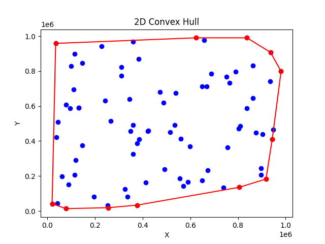
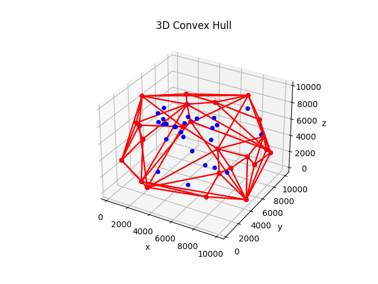
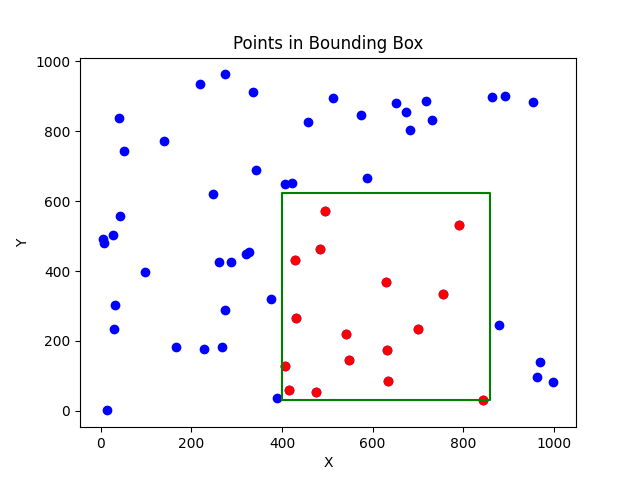
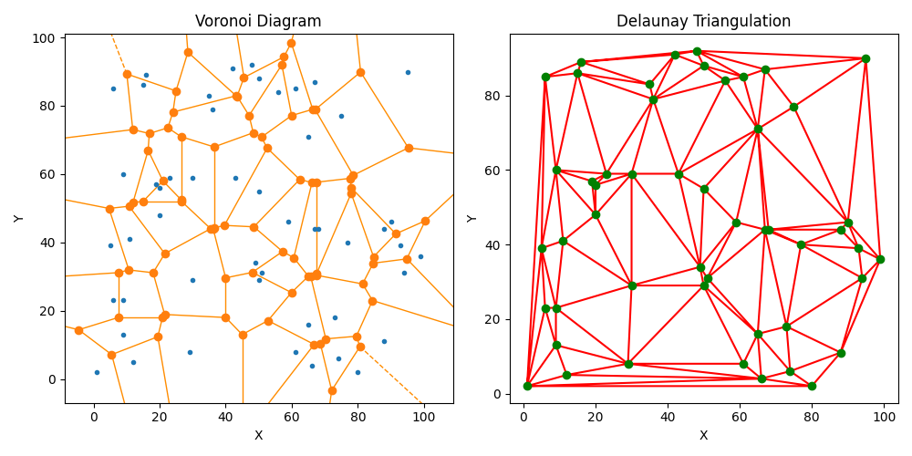
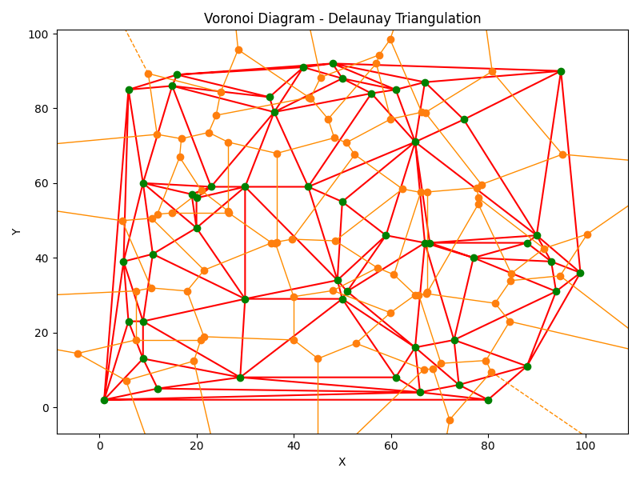

# Convex-Hull-Algorithms

**Kyriakopoulos Dimitris**  
**1115201900093**


Given a set of points in the plane, the convex hull of the set is the smallest convex polygon that contains all the points of it. In this project we implemented well-known convex hull algorithms for 2D and 3D points, illustrated the correspondence between the Delaunay triangulation and the Voronoi diagram and implement KD trees for orthogonal geometric search. More specifically for the convex hull of 2D points we used the incremental, the Jarvis, the Divide & Conquer and the Quick Hull algorithms to compute the convex hull of 2D point datasets. The Quick Hull was used for the computation of convex hull of 3D points dataset too. We compare each method based on the quality of the results and the runtime required to compute the convex hull. Each point set used in the execution of the algorithms was randomly generated using the discrete uniform distribution.

## Convex Hull Visualizations
In the image below we see the convex hull computed for 80 random 2D points. Obviously the result was the same for all the algorithms.


In the image below we can see the convex hull computed for 50 random 3D points using Quick Hull algorithm.


## Algorithms Comparison  
In the  table below we see the execution time of each convex hull algorithm for each points dataset. The datasets where randomly generated and include collinear points. We observe the Divide & Conquer algorithm was not successfully executed as the datasets included points with same X coordinates.  
<br>

**Convex Hull Algorithms: Time/NoOfPoints - Collinear Points**
| Total Points | 10 | 100 | 1000 | 10000 | 100000 | 
| --- | --- | --- | --- | --- | --- |
| Incremental | 0 | 0.00000 | 0.01806 | 0.01681 | 1.80719 |   
| Jarvis | 0 | 0.01642 | 0.12860 | 1.10671 | 10.88858 |
| Divide & Conquer | - | - | - | - | - |
| Quick Hull | 0 | 0.00000 | 0.00757 | 0.00665 | 0.04001 |

<br>   

In the table below we see the execution time of each convex hull algorithm for each points dataset. The datasets where randomly generated.     


<br>

**Convex Hull Algorithms: Time/NoOfPoints**
| Total Points | 10 | 100 | 1000 | 10000 | 100000 |
| --- | --- | --- | --- | --- | --- |
| Incremental | 0 | 0 | 0.00000 | 0.04847 | 0.44675 |
| Jarvis | 0 | 0.007 | 0.00800 | 0.16059 | 2.18975 | 
| Divide & Conquer | 0 | 0 | - | - | - |
| Quick Hull | 0 | 0.00801 | 0.00000 | 0.00000 | 0.01634 |

<br>


In the table below we see the execution time of each convex hull algorithm for each 2D point dataset. The datasets where randomly generated and are constrained not to include points with same x coordinate to ensure successful execution of the Divide & Conquer algorithm.      


<br>

**Convex Hull Algorithms: Time/NoOfPoints - Different X Coords**
| Total Points | 10 | 100 | 1000 | 10000 | 100000 |
| --- | --- | --- | --- | --- | --- |
| Incremental | 0 | 0 | 0 | 0.04002 | 0.50217 |  
| Jarvis | 0 | 0.00085 | 0.0075 | 0.23282  | 2.07023 | 
| Divide & Conquer | 0 | 0 | 0.016 | 0.13892 | 1.76016 |
| Quick Hull | 0 | 0 | 0 | 0 | 0.01557 |
<br>


In the table below we see the time complexity in the worst case for each algorithm. **n** is the number of points of the initial dataset and **h** is the number of convex hull's points.      


<br>

**Convex Hull Algorithms: Time Comlexity/Algorithm**
| Incremental | Jarvis | Divide & Conquer | Quick Hull | 
| --- | --- | --- | --- | 
| $O(nlogn)$ | $O(nh)$ | $O(nlogn)$ | $O(n^2)$ | 

<br>

All of these 2D algorithms discussed above can accomplish what they intend to output. However, they have different time complexity with the fastest Graham scan and divide and conquer algorithm. Although Quick Hull has $O(n^2)$ time complexity it seems to be realy fast as its average time complexity is $O(nlogn)$. Regarding the implementation of the algorithms, divide & conquer was the most difficult and the most time consuming to implement.

## KD Trees - Geometric Search
Building the KD Tree given a point set, we divide by the x coordinate, then by the y coordinate and then again by the x coordinate and so on using the median of the respective coordinate each time.
The geometric search regards to all the points existing in the KD Tree that are inside a given bounding box. The time complexity of the construction of the KD Tree, given a point set of size n, is $O(nlogn)$. The space complexity is $O(n)$ and the complexity of the search of the points that lie inside the bounding box is $O(\sqrt{n}+k)$, where k is the number of reported points.

In the image below we see a randomly generated point set of 60 points, a randomly generated bounding box and the points of the point set that lie in the bounding box using the KD trees. 



## Voronoi Diagram - Delaunay Triangulation
The **Voronoi diagram** of the set P of n foci is the subdivision of the plane into n cells (regions, bases), one for each focus. The cell of a focus contains all those points that are closer to the focus than to any other focus.    
<br>
The **Delaunay triangulation** of a given set of foci in the plane is the dual graph of the Voronoi diagram of foci.

Given a randomly generated point set of 50 points, in the images below we illustrate the correspondence between the Delaunay triangulation and the Voronoi diagram for thi set.





**Voronoi Diagram Complexity:**   

**Time Complexity:** Computing a Voronoi diagram for n sites takes $O(nlogn)$ operations. This complexity arises from the underlying algorithm's dependence on sorting the input points, usually using techniques like quicksort or mergesort. The additional operations required for constructing the diagram have a lower order of complexity.    

**Space Complexity:** The Voronoi diagram construction requires $O(n)$ storage. This complexity arises from the need to store the vertices and edges of the resulting diagram. The storage requirements are proportional to the number of vertices and edges, which have an upper bound of 2n-5 and 3n-6, respectively.

<br>

**Delaunay Triangulation Complexity:**    

**Time Complexity:** Computing a Delaunay triangulation of n points also takes $O(nlogn)$ time. Similar to Voronoi diagrams, this complexity arises from the sorting step in the underlying algorithm. The additional operations involved in constructing the triangulation have a lower order of complexity.    

**Space Complexity:** The Delaunay triangulation algorithm requires $O(n)$ storage. This complexity arises from the need to store the resulting triangles and their connectivity information. The storage requirements are proportional to the number of triangles, which has an upper bound of 2n-2.


Overall, both Voronoi diagrams and Delaunay triangulations have similar time and space complexities, making them computationally efficient for moderate-sized inputs.

## Usage - Requirements
The execution command is: 

```
$ python geometry_algos.py
```

The tabulate and scipy packages are neccessary for this project.
